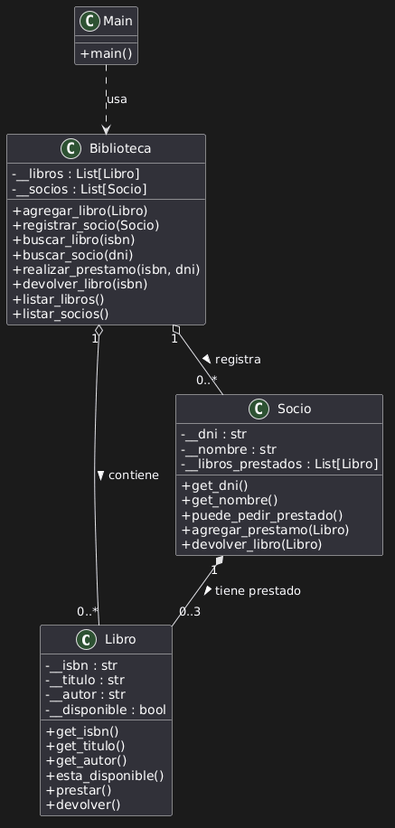

# FINALTESTEO - Sistema de Gestión de Biblioteca

**Trabajo Práctico Final - Testing de Software**  
**Universidad de Belgrano** - Técnico en Programación de Computadoras

## 1.1 Descriptivo del Software

**Objetivo del Software:**  
Desarrollar un sistema simple orientado a objetos para la gestión de una biblioteca, permitiendo el registro de libros y socios, realización de préstamos y devoluciones con las validaciones correspondientes.

**Requerimientos Funcionales Implementados:**
- Alta, búsqueda y listado de Libros
- Alta y listado de Socios
- Realizar Préstamos (validando disponibilidad del libro y máximo 3 libros por socio)
- Devolución de Libros
- Listados completos

**Requerimientos No Funcionales:**
- Desarrollado en **Python 3** con Programación Orientada a Objetos
- Uso de Encapsulación
- Interfaz por consola intuitiva y amigable
- Código modular, legible y comentado

## 1.3 Artefactos UML



## 1.4 Link al Repositorio

**Repositorio GitHub:**  
[https://github.com/Guidoolivero/FinalTesteo](https://github.com/Guidoolivero/FinalTesteo)

### Cómo ejecutar el programa

```bash
python main.py
