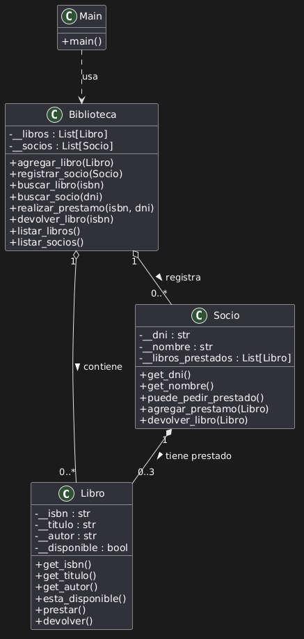

# FINALTESTEO - Sistema de Gestion de Biblioteca

**Trabajo Practico Final - Testing de Software**  
**Universidad de Belgrano** - Tecnico en Programacion de Computadoras

## 1.1 Descriptivo del Software

**Objetivo del Software:**  
Desarrollar un sistema simple orientado a objetos para la gestion de una biblioteca, permitiendo el registro de libros y socios, realizacion de prestamos y devoluciones con las validaciones correspondientes.

**Requerimientos Funcionales Implementados:**
- Alta, busqueda y listado de Libros
- Alta y listado de Socios
- Realizar Prestamos (validando disponibilidad del libro y maximo 3 libros por socio)
- Devolucion de Libros
- Listados completos

**Requerimientos No Funcionales:**
- Desarrollado en **Python 3** con Programacion Orientada a Objetos
- Uso de Encapsulacion
- Interfaz por consola intuitiva y amigable
- Codigo modular, legible y comentado

## 1.3 Artefactos UML



## 1.4 Link al Repositorio

**Repositorio GitHub:**  
[https://github.com/Guidoolivero/FinalTesteo](https://github.com/Guidoolivero/FinalTesteo)

### Como ejecutar el programa

1. Clonar o descargar el repositorio.
2. Abrir una terminal en la raiz del proyecto.
3. Instalar dependencias (recomendado):

```bash
python3 -m pip install -r requirements.txt
```

4. Ejecutar la aplicacion:

```bash
python3 main.py
```

## 2. Diseno de un conjunto de Pruebas

Matriz completa: [docs/MATRIZ_PRUEBAS.md](docs/MATRIZ_PRUEBAS.md)

### 2.1 Prueba de componentes

Archivos: `tests/test_libro.py`, `tests/test_socio.py`, `tests/test_biblioteca_componente.py`

- Clase `Libro`: getters, prestamo y devolucion
- Clase `Socio`: limite de 3 prestamos
- Clase `Biblioteca`: busquedas, listados vacios, devolucion sin prestamo

### 2.2 Prueba de Integracion

Archivo: `tests/test_biblioteca.py`

- Prestamo exitoso entre `Biblioteca`, `Libro` y `Socio`
- Fallos por libro o socio inexistente

### 2.3 Prueba de Caja Negra

Archivo: `tests/test_caja_negra.py` (marker `caja_negra`)

Se valida solo la API publica (`realizar_prestamo`, `devolver_libro`, `buscar_*`, `esta_disponible`) sin inspeccionar atributos privados.

```bash
python3 -m pytest -m caja_negra -v
```

### 2.4 Prueba de Rendimiento

Archivo: `tests/test_rendimiento.py` (marker `benchmark`)

- Alta de 1000 libros
- Busqueda de ISBN en catalogo grande
- Registro de 200 socios
- 100 prestamos consecutivos

```bash
python3 -m pytest tests/test_rendimiento.py -v --benchmark-only
```

### 2.5 Prueba de Interfaz

Archivo: `tests/test_e2e.py` - validacion del menu de consola, mensajes al usuario y opcion invalida. Ver [docs/MATRIZ_PRUEBAS.md](docs/MATRIZ_PRUEBAS.md) (columna Interfaz).

### 2.6 Prueba de Camino

Archivo: `tests/test_e2e.py` - caminos felices y de error (prestamo, devolucion, alta, salida). Ver [docs/MATRIZ_PRUEBAS.md](docs/MATRIZ_PRUEBAS.md) (columna Camino).

### Como ejecutar los tests (punto 2)

```bash
python3 -m pytest -v
```

## 3. Planificar la ejecucion de las Pruebas

### 3.1 Planificacion de la ejecucion

**Orden de ejecucion (puntos 2 y 3):**
1. Componentes (`Libro`, `Socio`, `Biblioteca`)
2. Integracion
3. Caja negra
4. Rendimiento
5. Interfaz y camino (tests E2E del menu; ver tambien punto 4)

**Punto 4 (E2E completo):** ejecutar despues, con `pytest -m e2e -v`

**Comando:**

```bash
python3 -m pytest -v
```

### 3.2 Ejecucion de las Pruebas y Documentacion

**Fecha de ejecucion:** 2 de junio de 2026

**Documentacion de ejecucion:** [docs/MATRIZ_PRUEBAS.md](docs/MATRIZ_PRUEBAS.md)  
**Documentacion E2E (punto 4.1):** [docs/PRUEBAS_E2E.md](docs/PRUEBAS_E2E.md)

| Test | Tipo | Resultado |
|------|------|-----------|
| tests/test_libro.py (2 tests) | Componente | PASSED |
| tests/test_socio.py (1 test) | Componente | PASSED |
| tests/test_biblioteca_componente.py (5 tests) | Componente | PASSED |
| tests/test_biblioteca.py (2 tests) | Integracion | PASSED |
| tests/test_caja_negra.py (8 tests) | Caja negra | PASSED |
| tests/test_rendimiento.py (4 tests) | Rendimiento | PASSED |
| tests/test_e2e.py (7 tests) | E2E | PASSED |

**29 passed in ~5s** (incluye benchmarks de rendimiento)

## 4. Pruebas End-to-End (E2E)

Se aplicaron pruebas E2E automatizadas sobre el flujo completo de la consola: se ejecuta `main.py`, se simulan entradas del usuario y se validan los mensajes de salida.

**Archivo:** `tests/test_e2e.py` (marker `e2e`)

**Escenarios:** prestamo exitoso, libro no disponible, devolucion, alta de libro y listado, registro de socio, opcion invalida, salida del programa.

```bash
python3 -m pytest -m e2e -v
```

### 4.1 Documentacion

Informe con objetivo, matriz de casos, comandos y evidencia de ejecucion:

[docs/PRUEBAS_E2E.md](docs/PRUEBAS_E2E.md)